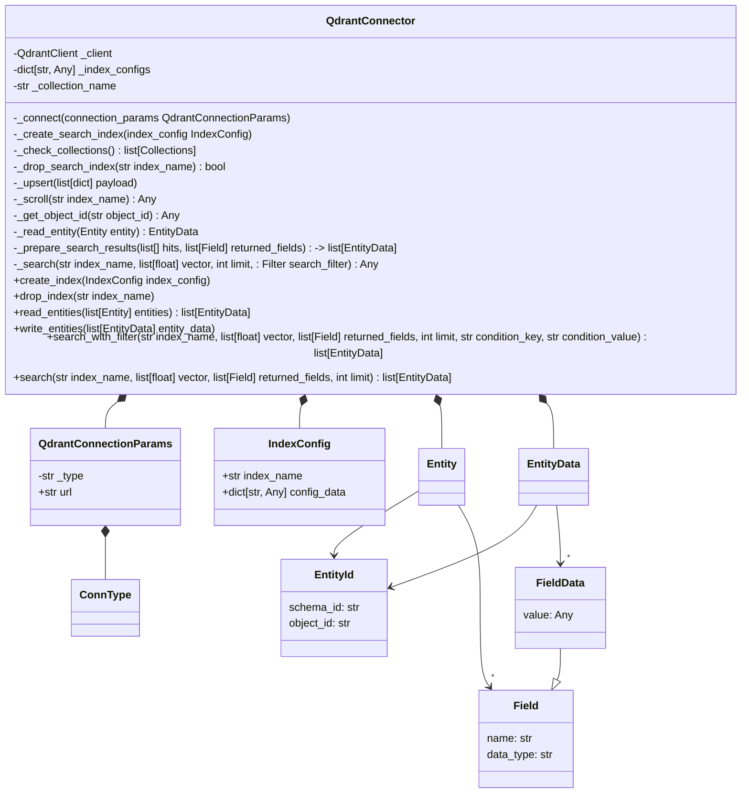

# Qdrant connector
This is an implementation of a connector for Qdrant vector db.

## Usage:
To use this connector the qdrant-client package has to be installed.
To run the unit tests, you need the pytest package.
You can use the provided requirements file to install these via pip.

The connector supports basic read, write and search operation.

## Operations
The list of operations is the following:
- `read_entities(entities: list[Entity])`: retrieve entities from the vdb; the result must contain the set of payload and / or vector fields described by the `Entities`' `fields` attributes
- `write_entities(entity_data: list[EntityData])`: store entities in the vdb
- `create index(index_config: indexCofnig)`: define a search index supporting ann- or knn-search
- `drop_index(index_name: str)`: remove index
- `search(index_name: str, vector: list[float], returned_fields: list[Field], limit: int)`: query the vdb's given index for entities similar to a given vector; the result must contain the fields listed in `returned_fields`

The connector creates a connection to Qdrant vdb with a given connection type and specified index configs.
Indices can be created and used for storing entity data in the vdb.
For using indices the connector creates collections in qdrant to represent the data structure required.
To store data in the vdb a connector object has to be created an initialized and at least one index has to be created.

## Limitations/simplifications:
- read_entities and write_entities operations are working on the last created index as based on the specification only, there is no clear way to determine the index to be used from the data.
- when storing data if the entity data has no vector type field, then an example vector ([0.0]) has to be inserted as it is required by qdrant to have a vector for each upsert operation.

## Classes:

## Testing:

unit tests are provided for the QdrantConnector and QdrantConnectionParams classes using pytest framework.
